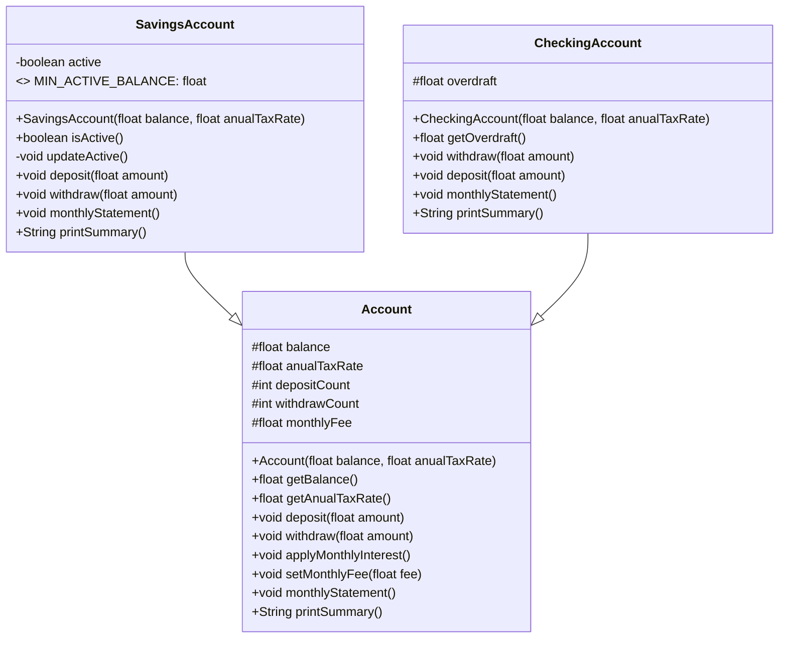

# bank-account

> **Resumen:** Implementación guiada por pruebas (TDD) de un sistema de cuentas bancarias con herencia: `Account` (base), `SavingsAccount` (ahorros) y `CheckingAccount` (corriente con sobregiro). Incluye suite de tests con JUnit 5 y reporte de cobertura con JaCoCo.

---

## 🧭 Objetivos de aprendizaje

- Practicar **TDD** (Rojo → Verde → Refactor) para construir clases paso a paso.
- Aplicar **herencia y override** en Java para especializar comportamientos.
- Manejar **excepciones** de estado (`IllegalStateException`) y de negocio.
- Escribir **tests legibles** con JUnit 5 (`assertEquals` con delta para `float`, `assertThrows`, `@BeforeEach`).
- Generar **cobertura** con JaCoCo y leer el reporte.
- Mantener **estándares de Git**: ramas por tipo y Conventional Commits.
- Separar **lógica de dominio** de la E/S (no `System.out.println` dentro de la lógica).

---

## 🧰 Requisitos

- **Java 17+** (también válido con Java 21; ver nota de compatibilidad).
- **Apache Maven 3.8+**
- **JUnit 5** (Jupiter)
- **JaCoCo** para cobertura.

> **Compatibilidad JDK 21:** si usas Java 21, se recomienda `jacoco-maven-plugin >= 0.8.11` y `maven-surefire-plugin >= 3.1.2` para evitar `Unsupported class file major version` en la instrumentación.

---

## 🗂️ Estructura del proyecto (Maven)

```
├─ pom.xml
├─ src
│  ├─ main
│  │  └─ java
│  │     └─ dev/marisol
│  │        ├─ Account.java
│  │        ├─ SavingsAccount.java
│  │        └─ CheckingAccount.java
│  └─ test
│     └─ java
│        └─ dev/marisol
│           ├─ AccountTest.java
│           ├─ SavingsAccountTest.java
│           └─ CheckingAccountTest.java
└─ target/...
```

---

## ▶️ Cómo ejecutar

```bash
# Ejecutar tests
mvn test

# Ejecutar tests + generar cobertura
mvn clean test jacoco:report

# Abrir el informe de cobertura
# Ruta: target/site/jacoco/index.html
```

> **Floats y delta:** cuando compares `float`/`double` en tests, usa `assertEquals(expected, actual, delta)` para evitar fallos por redondeo.

---

## 🧪 Metodología TDD

1. **Rojo:** escribe primero un test que falla describiendo el comportamiento deseado.
2. **Verde:** implementa lo mínimo para que el test pase.
3. **Refactor:** limpia el código manteniendo los tests en verde (naming, extracción de helpers, eliminación de duplicación).

**Ejemplos aplicados:**  
- `SavingsAccount` comienza **activa** si `balance ≥ 10000f`; si no, está **inactiva**.  
- Si está **inactiva**, `deposit` y `withdraw` **lanzan** `IllegalStateException`.  
- En el extracto de Ahorros, si `withdrawCount > 4`, se cobra **$1000** por cada retiro adicional **antes** de aplicar el interés mensual.  
- En Corriente, `withdraw` **permite sobregiro** (saldo → 0; el resto va a `overdraft`), y `deposit` **paga primero** el `overdraft` y el excedente pasa a saldo.

---

## 🧩 Diseño (clases y reglas)

### Account (base)
- **Atributos (`protected`)**: `balance: float`, `anualTaxRate: float`, `depositCount: int`, `withdrawCount: int`, `monthlyFee: float`.
- **Constructor**: `Account(float balance, float anualTaxRate)`.
- **Comportamiento**:
  - `deposit(float amount)`: suma a `balance` y `depositCount++`.
  - `withdraw(float amount)`: lanza `IllegalArgumentException` si `amount > balance`; en caso válido, resta y `withdrawCount++`.
  - `applyMonthlyInterest()`: interés mensual = `balance * (anualTaxRate / 12f)`; se suma al saldo.
  - `setMonthlyFee(float fee)`: configura `monthlyFee` de ese mes.
  - `monthlyStatement()`: `balance -= monthlyFee;` y luego `applyMonthlyInterest()`.
  - `printSummary()`: **devuelve** un `String` (no imprime) con resumen legible.

> **Separación de responsabilidades:** `printSummary()` retorna `String`; la impresión en consola/UI es responsabilidad de otra capa.

### SavingsAccount (ahorros)
- **Regla de activación**: activa si `balance ≥ 10000f` (constante `MIN_ACTIVE_BALANCE`).
- **Métodos clave**:
  - `isActive()`: consulta del estado.
  - `deposit/withdraw`: si **no** está activa → `IllegalStateException`. Si está activa, delegan en `Account` y luego **recalcula** estado.
  - `monthlyStatement()`: cobra **extra** `max(0, withdrawCount - 4) * 1000f` **antes** del flujo base (fee + interés), y actualiza estado.
  - `printSummary()`: “Saldo”, “Comisión mensual”, “Transacciones”.

### CheckingAccount (corriente con sobregiro)
- **Atributo**: `overdraft: float` (deuda acumulada).
- **Métodos clave**:
  - `withdraw(float amount)`: si `amount <= balance`, delega en `Account`; si `amount > balance`, consume saldo, setea `balance=0` y acumula `overdraft += (amount - saldoPrevio)`; `withdrawCount++`.
  - `deposit(float amount)`: paga primero el `overdraft` (`min(amount, overdraft)`) y el resto va a `balance`; `depositCount++`.
  - `monthlyStatement()`: delega en `Account` (no cambia `overdraft`).
  - `printSummary()`: incluye “Sobregiro”.

---

## ✅ Casos de prueba principales

- **Account**
  - Constructor inicializa `balance` y `anualTaxRate`.
  - `deposit` aumenta saldo y contador.
  - `withdraw` válido resta saldo y sube contador.
  - `withdraw` inválido (`amount > balance`) lanza `IllegalArgumentException` y no cambia estado.
  - `applyMonthlyInterest` suma el interés mensual.
  - `monthlyStatement` descuenta `monthlyFee` y luego interés.
  - `printSummary` contiene etiquetas esperadas.

- **SavingsAccount**
  - Activa si `balance ≥ 10000f`; inactiva en caso contrario.
  - `deposit` y `withdraw` **rechazados** con `IllegalStateException` si inactiva.
  - Extracto: cobra `$1000` por retiro adicional (>4) **antes** de interés.
  - `printSummary` con “Saldo/Comisión mensual/Transacciones”.

- **CheckingAccount**
  - `withdraw` permite **sobregiro** (saldo 0; diferencia a `overdraft`).  
  - `deposit` con deuda: **reduce** `overdraft` primero (saldo queda 0 si pago parcial).  
  - `deposit` mayor que deuda: `overdraft → 0` y **excedente** al saldo.  
  - `monthlyStatement` **no** cambia `overdraft`; aplica fee + interés sobre el **balance**.
  - `printSummary` con “Sobregiro”.

> **Delta en floats**: usa `0.0001f` (o similar) en `assertEquals(expected, actual, delta)` para evitar falsos rojos por coma flotante.

---

## 📈 Cobertura

- Comando: `mvn clean test jacoco:report`
- Informe: `target/site/jacoco/index.html`
- Si el informe sale vacío:
  - Verifica que existan clases compiladas en `target/classes`.
  - Revisa versiones de `jacoco-maven-plugin` y `maven-surefire-plugin` si usas JDK 21.
- Umbral recomendado: **≥ 70%** global. (Ideal > 90% cubriendo ambas ramas en métodos con `if`/`else`.)

---

## 🌿 Flujo de ramas y commits

**Prefijos de ramas**
- `feat/` nueva funcionalidad
- `test/` solo pruebas
- `refactor/` mejoras internas sin cambiar comportamiento
- `fix/` corrección de bug
- `chore/` config/herramientas/docs

**Conventional Commits (en inglés, imperativo)**
- `feat(checking): deposit pays overdraft first and sends excess to balance`
- `test(savings): reject deposit when inactive (IllegalStateException)`
- `refactor(savings): extract MIN_ACTIVE_BALANCE and updateActive()`
- `chore: add JaCoCo report instructions to README`

---

## 🧱 Errores típicos y cómo evitarlos

- **`float` sin sufijo `f`** → Java lo interpreta como `double`. Usa `100f`, `0.05f`.
- **Comparar floats sin delta** → `assertEquals` con `delta` pequeño (p.ej. `0.0001f`).
- **`/n` en vez de `
`** → usa `System.lineSeparator()` para portabilidad.
- **`@Override` ausente** → arriesgas no sobrescribir realmente. Añade `@Override` siempre que redefinas métodos del padre.
- **Lógica de negocio en `println`** → `printSummary()` debe **devolver** `String`. No mezclar E/S con dominio.
- **Nombres inconsistentes** → usa los mismos del código (p.ej., `anualTaxRate`, `monthlyFee`, `overdraft`).

---

## 🧾 UML (diagrams.net / Mermaid)



---

## 🔗 Referencias (oficiales)

- **Oracle Java Docs**
  - *Inheritance & Overriding*: https://docs.oracle.com/javase/tutorial/java/IandI/
  - *Language Basics (Literals, escape sequences)*: https://docs.oracle.com/javase/tutorial/java/nutsandbolts/
- **JUnit 5 User Guide**
  - *Writing Tests & Assertions (`assertThrows`, `assertEquals` with delta)*: https://junit.org/junit5/docs/current/user-guide/
- **Apache Maven**
  - *Standard Directory Layout*: https://maven.apache.org/guides/introduction/introduction-to-the-standard-directory-layout.html
- **JaCoCo**
  - *Maven Plugin*: https://www.jacoco.org/jacoco/trunk/doc/maven.html

---

## 📦 Entregables

- Código con tests **en verde**.
- **README** (este archivo).
- **Diagrama UML** (`.drawio` + imagen exportada).
- **Captura de cobertura** (tabla principal de JaCoCo).
- Historial de ramas/commits **limpio** y descriptivo.

---

## 📝 Licencia

MIT (o la que el curso/empresa indique).

---

¡Listo! Ejecuta los comandos, genera el reporte, adjunta las capturas y sube el UML. Cualquier mejora o refactor posterior se apoya en la suite de tests y la cobertura.
